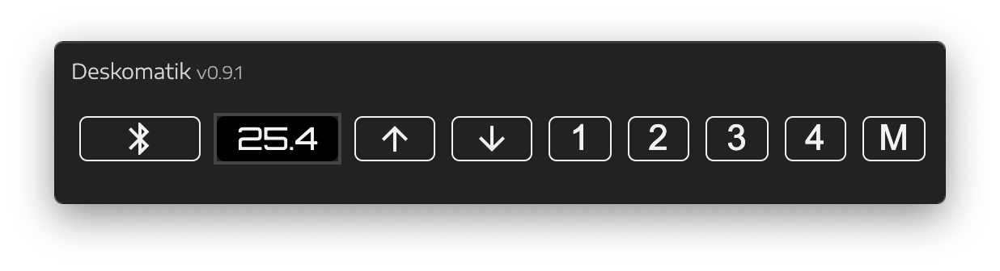

# idasen-desk-controller (Deskomatik)
JavaScript/Bluetooth App for Controlling Ikea Idasen (Linak) Desks

## Why?

So, I tried the Linak desktop software and, as far as I could tell, it was unusable.  It had marketing/gimmicky features I didn't care about and I couldn't actually figure out how to use it.  So, I set out to create an app with some usability and utility in mind.  It's still a work-in-progress.

* This is not packaged yet.  Maybe within next couple of weeks.
* Shall not be responsible for anything that falls off your desk,
or for any electrical socket damage, or for *any* other damage that may result
from using this software. :)

### Features

* Current height
* Up/down
* Store height
* Move to height

### Pending

* Package as app
* Better tooltips for positions
* Highlight current position
* Allow multiple Idasen desks?  Currently syncs to devices with "Desk" in name.
* Better move-to accuracy?  Accuracy is currently within .1-.2 of inch, I think.
